# YawnJob

[](LICENSE)
[](docs/SCHEMA.md)
[](https://yawn.ai/docs)
[](https://discord.gg/yawn)

> **AWAKEN! AWAKEN!**

A cron job with a brain. The holonic unit of AI-native work.

[Website](https://yawn.ai) | [Whitepaper](https://yawn.ai/yawnjob/whitepaper) | [Docs](https://yawn.ai/docs) | [Network](https://yawn.ai/yawn-network) | [Jobs Library](https://yawn.ai/jobs) | [Discord](https://discord.gg/yawn) | [Examples](examples/)

---

## What is a YawnJob?

A **YawnJob** is a holonic, AI-native, super-capable Job-to-be-Done.

Think of it as the fundamental unit of work that bridges human intention and AI execution. Unlike traditional cron jobs that blindly run commands, a YawnJob knows:

- **WHY** it exists (intention)
- **WHAT** blocks success (obstacles)
- **HOW** to prove it worked (evidence)
- **WHAT** it learned (insights)


**This repository IS a YawnJob.** The `ROOT.yawn` file is both the template and its own proof. You're reading the documentation of a system that documents itself.

---

## Why YawnJobs?

Traditional approaches to AI autonomy fail in predictable ways:

| Problem | Traditional Approach | YawnJob Solution |
|---------|---------------------|------------------|
| **Wandering** | Agents lose focus, drift off task | Bounded by intention + acceptance test |
| **No proof** | "Trust me, it's done" | Evidence required for completion |
| **No learning** | Same mistakes repeated | Insights graduate to rules/skills |
| **Brittle** | Breaks on edge cases | Holonic structure handles complexity |
| **Opaque** | Black box execution | Full audit trail in .yawn file |

### The 5 Layers

Every YawnJob has exactly 5 layers:

```yaml
1. INTENTION   # What you want to be true
2. OBSTACLES   # What blocks progress
3. JOB         # The action to take (scheduled or on-demand)
4. EVIDENCE    # Proof it worked
5. LEARNING    # What we learned (graduates to skills/rules)
```

### The 8-Phase Loop

Every YawnJob follows this lifecycle:

```mermaid
flowchart LR
    S[👁️ SENSE] --> M[🗺️ MAP]
    M --> PR[🔮 PREDICT]
    PR --> EX[🧭 EXPLORE]
    EX --> D[⚖️ DECIDE]
    D --> A[⚡ ACT]
    A --> P[✅ PROVE]
    P --> L[📚 LEARN]
    L -.-> S

    style S fill:#ffeaa7
    style M fill:#74b9ff
    style PR fill:#a29bfe
    style EX fill:#55efc4
    style D fill:#fd79a8
    style A fill:#fdcb6e
    style P fill:#00b894
    style L fill:#e17055
```



| Phase | What Happens |
|-------|--------------|
| **SENSE** | Detect trigger, feel the intention |
| **MAP** | Understand context, find relevant .yawns |
| **PREDICT** | Generate possible approaches |
| **EXPLORE** | Present options if multiple viable paths |
| **DECIDE** | Choose approach, get approval if needed |
| **ACT** | Execute the job |
| **PROVE** | Collect evidence of completion |
| **LEARN** | Extract insights, update .yawn files |

### Holarchy: Parts AND Wholes

YawnJobs are **holonic** - each one is both a part of something larger and a whole containing smaller parts:

```mermaid
graph TD
    ROOT[🏢 Organization Root Yawn]
    ROOT --> TEAM1[👥 Team Objective]
    ROOT --> TEAM2[👥 Another Team]
    TEAM1 --> JOB1[📋 This YawnJob]
    TEAM1 --> JOB2[📋 Related Job]
    JOB1 --> CHILD1[📝 Sub-task 1]
    JOB1 --> CHILD2[📝 Sub-task 2]

    style JOB1 fill:#ff9,stroke:#f90,stroke-width:3px
```



When a YawnJob grows too complex (>500 lines, 3+ domains), it **graduates** by spawning children or skills.

---

## Quick Start

### Option A: 1-Touch Creation (Recommended)

The fastest way — one button, everything automated:

1. Sign in to [yawn.ai](https://yawn.ai) with GitHub
2. Tap **"New Yawn"** in the sidebar
3. Type a repo name (validated in real-time)
4. Tap **"Create — Start Free"**

That's it. Your YawnJob is forked, hosted, and live with 30 days of free hosting. No credit card required. [Learn more →](https://yawn.ai/one-touch-yawnjob)

### Option B: Manual Fork

```bash
# Option B1: Via GitHub UI
# Click "Fork" button above

# Option B2: Via gh CLI
gh repo fork yawn-ai/yawnjob --clone
```

### Configure ROOT.yawn

Open `ROOT.yawn` and replace all `{{PLACEHOLDERS}}`:

```yaml
# Before
title: "{{YOUR_YAWNJOB_TITLE}}"
intention: "{{What you want to be true}}"

# After
title: "Daily Security Audit"
intention: "All production endpoints pass security checks every morning"
```

### Import to yawn.ai

1. Go to [yawn.ai](https://yawn.ai) and sign in with GitHub
2. Navigate to Dashboard
3. Click "Import YawnJob"
4. Paste your `ROOT.yawn` content or link your repo
5. Select parent yawn (or leave as root)
6. Click Import

Your YawnJob now lives in your holarchy and can be scheduled, tracked, and learned from.

### 4. Submit evidence

As you complete work, submit evidence:

```yaml
# In your ROOT.yawn EVALUATIONS section
| Metric | Current | Target | Evidence Type | Status |
|--------|---------|--------|---------------|--------|
| Endpoints passing | 47/50 | 50/50 | test_log | Active |
```

Or via API:

```bash
curl -X POST https://yawn.ai/api/yawn/{your-yawn-id}/evidence \
  -H "Authorization: Bearer $TOKEN" \
  -d '{"evidence_type": "test_log", "content": "All checks passed"}'
```

---

## Comparison

### vs Traditional Cron

| Aspect | Cron | YawnJob |
|--------|------|---------|
| Definition | `0 9 * * * /script.sh` | Full .yawn file with context |
| Learning | None | Insights graduate to skills |
| Evidence | Exit code only | Structured proof types |
| Recovery | Manual | Self-healing with fallbacks |
| Visibility | Logs | Full audit trail |

### vs Auto-GPT / AgentGPT

| Aspect | Auto-GPT | YawnJob |
|--------|----------|---------|
| Scope | Unbounded | Bounded by intention |
| Evidence | None required | Required for completion |
| Learning | Per-session | Persists across sessions |
| Control | Runaway risk | Risk-level approval gates |
| Structure | Monolithic | Holonic (parts AND wholes) |

### vs OpenClaw

| Aspect | OpenClaw | YawnJob |
|--------|----------|---------|
| Purpose | Full AI assistant OS | Single unit of work |
| Complexity | High (full platform) | Low (one .yawn file) |
| Channels | WhatsApp, Telegram, etc. | Any (tool-agnostic) |
| Target | Single user assistant | Network of jobs |
| Integration | Self-contained | Connects to yawn.ai |

### vs LangChain / LangGraph

| Aspect | LangChain | YawnJob |
|--------|-----------|---------|
| Audience | Developers | Anyone (natural language) |
| Definition | Python/TypeScript code | YAML .yawn file |
| Execution | Code runtime | Yawn.ai orchestrator |
| Sharing | Code repos | .yawn files |
| Learning | Custom | Built-in graduation |

---

## The .yawn File Format

A `.yawn` file is a YAML-based document with standardized sections. See [docs/SCHEMA.md](docs/SCHEMA.md) for the full reference.

### Context Inheritance

YawnJobs inherit context from their parents:


Parent rules apply automatically. Local rules can extend but not contradict.

### Required Sections

```yaml
---
# Frontmatter with coherence metadata
schema_version: 2.0.0
coherence:
  score: 0.0
  questions_answered: 0
  questions_total: 18
navigation:
  parent: null
  keywords: []
---

# Title

## AWAKENING       # Intention + transformation
## ENTITIES        # Who/what is involved
## FORCES          # Blockers and boosters
## THE JOB         # Executable task definition
## DO's            # Prescriptive rules
## DON'T's         # Proscriptive rules
## CHECKS          # Automated validations
## EVALUATIONS     # Evidence metrics
## COMPLETION CONDITIONS
## GRADUATION CRITERIA
## EVOLUTION LOG   # Change history
## META            # System metadata
```

### Evidence Types

| Type | Description | Example |
|------|-------------|---------|
| `artifact` | File or output produced | `report.pdf`, `build.log` |
| `test_log` | Test execution output | CI/CD output |
| `screenshot` | Visual proof | UI before/after |
| `link` | URL to external proof | GitHub commit, Notion page |
| `self_attest` | Human attestation | "I verified this manually" |

---

## Quick Actions

Every yawn card surfaces a **Quick Actions** split-button — a compact, one-click engagement point:

```
┌───────────────────────────────────┐
│        Yawn Card Content          │
│                      [ ✦ | ▾ ]   │  ← Star (primary) + Dropdown (7 actions)
└───────────────────────────────────┘
```

| Action | What It Does |
|--------|-------------|
| **Star** | Save the yawn + star on GitHub |
| **Love** | Express deep appreciation |
| **Monetize** | Purchase Compute Coins (YCC) |
| **Connect** | Link to your yawn network |
| **Share** | Share via native share or clipboard |
| **Preview** | Preview like a social post |
| **Fork** | Fork to your own GitHub (creates origin-fee chain) |

Star is always one click. Everything else is in the dropdown. See [docs/QUICK_ACTIONS.md](docs/QUICK_ACTIONS.md) for the full specification.

---

## Checklist for Trustworthy Autonomy

A YawnJob meets these 8 criteria for safe autonomous operation:

- [ ] **Bounded scope** - Clear intention + acceptance test
- [ ] **Risk-level gates** - Approval required for write/spend/critical
- [ ] **Evidence required** - No completion without proof
- [ ] **Audit trail** - Full history in .yawn file
- [ ] **Learning loop** - Insights graduate to rules
- [ ] **Holonic structure** - Can split when complex
- [ ] **Human override** - Always can pause/cancel
- [ ] **Network coherence** - Connected to larger system

---

## Integration

### With Cursor

YawnJobs work seamlessly with Cursor AI. Your `.yawn` files provide context:

```
/yawn
# Cursor reads ROOT.yawn, understands intention, suggests actions
```

### With Claude Code

YawnJobs integrate with Claude Code via MCP:

```bash
# In your MCP config
{
  "mcpServers": {
    "yawn": {
      "command": "npx",
      "args": ["yawn-mcp-server"]
    }
  }
}
```

### With yawn.ai

After importing, your YawnJob connects to the network:

- **Holarchy** - Part of larger yawns, contains smaller yawns
- **Scheduling** - Cron-based execution via heartbeat API
- **Evidence** - Tracked in `yawn_evidence` table
- **Learning** - Insights shared across the network

See [docs/INTEGRATION.md](docs/INTEGRATION.md) for full API reference.

---

## Independent Hosting (NEW)

YawnJobs can be hosted **anywhere** — Vercel, Netlify, Cloudflare, self-hosted — while connecting back to the yawn.ai network securely. The `connect/` directory contains a zero-dependency SDK for this.

### YawnConnect SDK

```typescript
import { YawnConnect } from './connect/yawn-connect'

const yawn = new YawnConnect({
  apiKey: process.env.YAWN_API_KEY!,  // yawn_sk_... (server-side only)
  yawnSlug: 'my-yawnjob',
})

// Establish link to parent yawn
await yawn.handshake('parent-slug', 'child')

// Query connected yawns
const links = await yawn.getLinks()

// Submit evidence of work
await yawn.submitEvidence('yawn-uuid', {
  type: 'link',
  content: 'Deployment verified',
  proof_url: 'https://my-site.com',
})

// Health check
const status = await yawn.ping()
```

**Security**: API keys are SHA-256 hashed at rest. Never expose keys to client-side code. All requests over HTTPS. Scoped access only to connected yawns.

See [connect/README.md](connect/README.md) for full API reference.

### Real-World Example

See [examples/trademark-bitch.yawn](examples/trademark-bitch.yawn) — a live, independently hosted yawnjob that sells trademark filing services while constituting its own specimen of commercial use.

---

## File Structure

```
yawnjob/
├── ROOT.yawn              # Your YawnJob definition (schema-compliant)
├── README.md              # You are here
├── CHANGELOG.md           # Version history
├── CODE_OF_CONDUCT.md     # Community standards
├── CONTRIBUTING.md        # How to contribute
├── LICENSE                # MIT
├── SECURITY.md            # Vulnerability reporting
├── .github/
│   ├── ISSUE_TEMPLATE/    # Bug report & feature request forms
│   └── PULL_REQUEST_TEMPLATE.md
├── connect/
│   ├── yawn-connect.ts    # Zero-dep SDK for network connection
│   └── README.md          # SDK documentation
├── docs/
│   ├── README.md          # Documentation index
│   ├── WHITEPAPER.md      # The landscape of autonomous AI
│   ├── SCHEMA.md          # .yawn file format reference
│   ├── INTEGRATION.md     # API and connection guide
│   ├── COHERENCE.md       # What coherence means
│   ├── EARNING.md         # How to earn Yawn Coins
│   └── QUICK_ACTIONS.md   # Quick Actions specification
├── examples/
│   ├── README.md          # Examples guide
│   ├── hello-world.yawn   # Minimal example
│   ├── daily-security-audit.yawn  # Scheduled job
│   ├── content-sync.yawn  # Write-risk example
│   ├── database-backup.yawn       # Critical job
│   ├── life-domain.yawn   # Bipolar pole template
│   ├── quick-actions.yawn # Social engagement pattern
│   └── trademark-bitch.yawn # Independently hosted yawnjob (real-world)
└── evidence/
    └── README.md          # Evidence storage guide
```

---

## The Network

Every forked YawnJob becomes part of the yawn.ai network.

Check [yawn.ai/yawn-network](https://yawn.ai/yawn-network) to see the job network.

The more jobs that connect, the more coherent we become.

---

## Links

- **Website**: [yawn.ai](https://yawn.ai)
- **YawnJob Explainer**: [yawn.ai/yawnjob](https://yawn.ai/yawnjob) - Interactive guide
- **Whitepaper**: [yawn.ai/yawnjob/whitepaper](https://yawn.ai/yawnjob/whitepaper) - Full technical document
- **Network**: [yawn.ai/yawn-network](https://yawn.ai/yawn-network) - See the job network
- **Jobs Library**: [yawn.ai/jobs](https://yawn.ai/jobs) - Browse all jobs
- **Documentation**: [yawn.ai/docs](https://yawn.ai/docs)
- **Discord**: [discord.gg/yawn](https://discord.gg/yawn)
- **GitHub**: [github.com/yawn-ai](https://github.com/yawn-ai)

### Related Projects

- [Cursor](https://cursor.sh) - AI-first code editor
- [Claude Code](https://claude.ai/code) - Anthropic's coding assistant
- [OpenClaw](https://github.com/openclaw/openclaw) - Personal AI assistant platform
- [LangChain](https://langchain.com) - LLM application framework

---

## Attribution

Created by [yawn.ai](https://github.com/yawn-ai)

Built with love, Claude, and the belief that AI agents deserve purpose.

### Required Footer

All YawnJob pages must display the global footer:

> A secure open source [yawnjob.com](https://yawnjob.com) powered by [yawn.ai](https://yawn.ai)

See [docs/INTEGRATION.md](docs/INTEGRATION.md#global-footer-required) for implementation details.

**Yawn is your next move.**

---

*"A YawnJob is a holonic, AI-native, super-capable Job-to-be-Done. This repository is one."*
